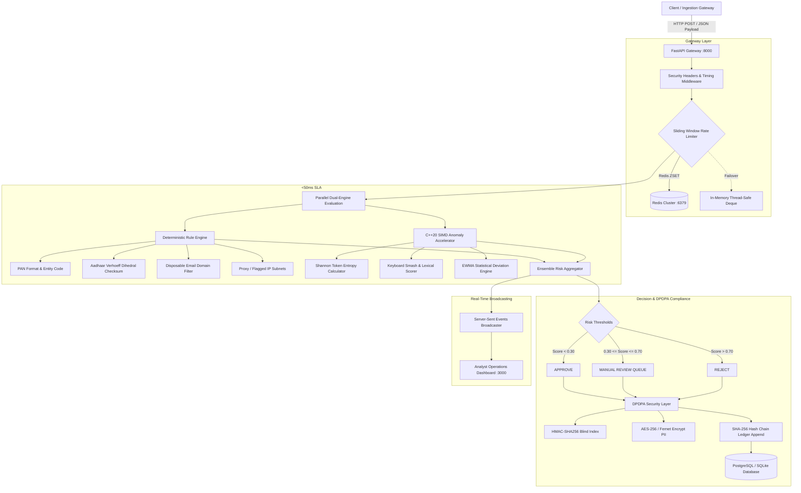

# Veles Shield: Architecture & Technical Design Specification

> **High-Throughput Identity & Transaction Risk Engine**  
> *Engineered for sub-50ms SLA targets with SIMD acceleration and DPDPA 2023 cryptographic auditability.*

---

## 1. System Topology & Product Alignment

Veles Shield provides a unified, production-grade fraud prevention pipeline directly mapped to IDfy's core enterprise suite:

| IDfy Core Product | Veles Shield Architectural Component | Subsystem Responsibility |
| :--- | :--- | :--- |
| **OnboardIQ** | **Identity Risk & KYC Pipeline** | C++20 SIMD Shannon entropy engine, Aadhaar Verhoeff dihedral group validation, Indian PAN structure verification, disposable email blacklisting, proxy/TOR IP screening. |
| **OneRisk** | **Real-Time Transaction Risk Engine** | Sliding-window velocity counters via Redis Sorted Sets, statistical EWMA outlier deviation scoring, human-in-the-loop analyst review queue, $<50\text{ms}$ latency guarantee. |
| **Privy** | **DPDPA 2023 Compliance & Privacy Engine** | Column-level AES-256/Fernet authenticated encryption, HMAC-SHA256 blind indexing for zero-knowledge searches, SHA-256 hash-chained immutable audit ledger, Right to Erasure execution. |

### End-to-End Pipeline Architecture



---

## 2. Mathematical Foundations

### 2.1 Shannon Entropy for Synthetic Identity Detection
Synthetic identities generated by bot scripts or automated form fillers frequently exhibit either abnormally low entropy (repetitive patterns, dictionary floods) or abnormally high entropy (pseudo-random string generation):

$$H(X) = -\sum_{i=1}^{n} P(x_i) \log_2 P(x_i)$$

Where:
- $n$ is the number of distinct characters in the input token.
- $P(x_i) = \frac{\text{count}(x_i)}{\text{length}(X)}$ is the empirical probability of character $x_i$.

**Classification Thresholds:**
- $H(X) < 1.2$: Flagged as **Repetitive Low-Entropy Anomaly** (e.g., `aaaaaaa`, `11111111`).
- $1.2 \le H(X) \le 4.2$: **Normal Human Distribution**.
- $H(X) > 4.2$: Flagged as **Synthetic High-Entropy Generation** (e.g., `q8x#m!9v$k2L`).

The C++ SIMD acceleration implementation (`backend/cpp/veles_engine.cpp`) vectorizes the frequency histogram and table-driven logarithms to calculate token entropy in **$<25\mu\text{s}$**.

### 2.2 Lexical Keyboard Smash & Bigram Analysis
To detect fraudulent names entered via random physical keyboard mash (e.g., `asdfghjk`, `qwerzxcv`), the engine evaluates three orthogonal metrics:

1. **Consonant-to-Vowel Ratio ($R_{cv}$):**
   $$R_{cv} = \frac{N_{\text{consonants}}}{N_{\text{vowels}} + 1}$$
   If $R_{cv} > 5.0$ on tokens longer than 6 characters, a smash penalty is added.

2. **QWERTY Adjacency Transitions ($T_{adj}$):**
   Given keyboard coordinate matrix $K(c) = (x_c, y_c)$, the Manhattan distance between consecutive characters $c_i, c_{i+1}$ is:
   $$\Delta K_i = |x_{c_{i+1}} - x_{c_i}| + |y_{c_{i+1}} - y_{c_i}|$$
   A sequence dominated by $\Delta K_i \le 1$ represents sequential sliding or row-smash.

3. **Maximum Consonant Clustering ($C_{max}$):**
   Identifies the longest contiguous run of consonants without an intervening vowel. English and Indic transliterated names rarely exceed 4 contiguous consonants. Runs $\ge 5$ trigger risk increments.

### 2.3 Exponentially Weighted Moving Average (EWMA) Outlier Detection
For transaction amounts, Veles Shield tracks streaming client history without requiring heavy SQL aggregation scans:

**Mean Update:**
$$\mu_t = \alpha \cdot x_t + (1 - \alpha) \cdot \mu_{t-1}$$

**Variance Update:**
$$\sigma_t^2 = \alpha \cdot (x_t - \mu_t)^2 + (1 - \alpha) \cdot \sigma_{t-1}^2$$

**Statistical Outlier Z-Score:**
$$Z_t = \frac{|x_t - \mu_{t-1}|}{\sqrt{\sigma_{t-1}^2} + \epsilon}$$

Where $\alpha = 0.20$ provides a responsive 5-period smoothing window, and $\epsilon = 1.0$ prevents division by zero on static histories. When $Z_t > 3.0$ (exceeding 3 standard deviations), a transaction risk factor of $+0.45$ is injected.

### 2.4 Verhoeff Dihedral Group ($D_5$) Algorithm
Indian 12-digit Aadhaar numbers utilize the Verhoeff check-digit algorithm based on the non-abelian dihedral group $D_5$ (symmetries of a regular pentagon, order 10). It detects **100% of all single-digit errors** and **95.3% of all adjacent transposition errors**.

The algorithm operates over three tables:
1. **Multiplication table $d(j, k)$**: Group operation in $D_5$.
2. **Permutation table $p(i, j)$**: Repeated application of permutation $\sigma = (0)(1 5 8 9 4 2 7)(\text{cycle})$.
3. **Inverse table $inv(j)$**: Inverse element such that $d(j, inv(j)) = 0$.

Validation formula for number $c_n c_{n-1} \dots c_1$:
$$\left( \sum_{i=1}^{n} d(c, p(i \bmod 8, c_i)) \right) = 0$$

Implemented natively in C++ (`veles_validate_verhoeff`) with zero memory allocations.

### 2.5 Indian PAN (Permanent Account Number) Structural Rules
PAN numbers conform to the deterministic 10-character syntax:
$$\text{PAN} = [A-Z]{3}[A-Z]{1}[A-Z]{1}[0-9]{4}[A-Z]{1}$$

The 4th character represents the legal entity classification:
- `P`: Individual (Natural Person)
- `C`: Company
- `H`: Hindu Undivided Family (HUF)
- `F`: Partnership Firm
- `A`: Association of Persons (AOP)
- `T`: Trust
- `B`: Body of Individuals (BOI)
- `L`: Local Authority
- `J`: Artificial Juridical Person
- `G`: Government Agency

The 5th character must match the first letter of the applicant's legal surname (for individuals).

---

## 3. High-Throughput Rate Limiting & Velocity Engine

### 3.1 Redis Sorted Set Sliding Window
Unlike fixed-window counters that suffer from 2x boundary spikes, Veles Shield implements a true sliding window using Redis Sorted Sets (`ZSET`):

```
Time -------------------------------------------------------->
[------- 60-second window -------]
|   *       *      *      *      |   (now)
|                                |
(now - 60s)                    (now)
```

**Atomic Pipeline Execution:**
1. `ZREMRANGEBYSCORE key -inf (now - window_seconds)`: Evicts expired timestamps outside window.
2. `ZCARD key`: Counts remaining operations in current sliding window.
3. `ZADD key now:nonce now`: Inserts current operation with high-precision timestamp.
4. `EXPIRE key (window_seconds + 5)`: Automatically clears dormant keys to prevent memory leaks.

### 3.2 High-Availability Circuit Breaker
To prevent external network degradation from breaching the **sub-50ms SLA**:
- Redis socket connection timeout is capped at **500ms**, with command execution timeout at **200ms**.
- If Redis fails or times out, the circuit breaker opens for **30 seconds**.
- While open, requests instantly route to an in-memory thread-safe circular deque, maintaining **$<0.05\text{ms}$** velocity check execution.

---

## 4. DPDPA 2023 Compliance & Privy Integration

The Digital Personal Data Protection Act (DPDPA 2023) mandates strict data fiduciary obligations for Indian fintechs.

### 4.1 Column-Level Authenticated Encryption
All sensitive personal identifiable information (PII) including `full_name`, `email`, `phone`, and `id_number` is encrypted using AES-256 authenticated symmetric encryption (Fernet specification):
- **Key:** 256-bit URL-safe base64 encryption key stored strictly in environment/secrets manager.
- **Ciphertext format:** Versioned, 128-bit IV, AES-128-CBC payload, authenticated via HMAC-SHA256 signature to prevent chosen-ciphertext tampering.

### 4.2 HMAC-SHA256 Blind Indexing
To prevent storing plaintext PII while still enabling rapid $O(1)$ lookups for duplicate identity detection and velocity tracking:

$$\text{BlindIndex}(X) = \text{HMAC-SHA256}(K_{secret}, \text{Normalize}(X))$$

- Search queries hash the input query and perform an indexed equality lookup against `email_hash` or `id_hash`.
- No database administrator or compromised read replica can recover the underlying PII from the blind index.

### 4.3 Immutable SHA-256 Tamper-Evident Audit Ledger
Every verification, manual review override, or erasure request appends a cryptographically linked block to the immutable audit ledger:

$$H_0 = \text{SHA256}(\text{"GENESIS"} \parallel \text{UUID} \parallel \text{Timestamp})$$
$$H_n = \text{SHA256}(n \parallel \text{Timestamp} \parallel \text{Action} \parallel \text{EntityID} \parallel \text{PayloadHash} \parallel H_{n-1})$$

**Integrity Verification (`/api/v1/dpdpa/audit-ledger/verify`):**
The endpoint performs an iterative verification from block 0 to tip. If an unauthorized actor modifies, deletes, or truncates any historical audit row, the entire subsequent hash chain is broken, instantly reporting the exact compromised sequence number.

### 4.4 Right to Erasure (DPDPA Sec 12)
Upon receiving a verified erasure request:
1. PII columns in `VerificationRecord` are replaced with cryptographic obliteration markers (`[ERASED-DPDPA-SEC12]`).
2. Blind index hashes are randomized or zeroed to sever external lookup capability.
3. An immutable audit record is appended with action `PII_ERASURE_EXECUTED`, preserving the regulatory chain of custody while completely destroying the personal data.

---

## 5. Microservices & Network Topology

```
+-------------------------------------------------------------------------+
|                              Veles Shield                               |
|                                                                         |
|   +-----------------------+                +-----------------------+    |
|   |    React Dashboard    |                |   FastAPI Gateway     |    |
|   |    (Vite / Nginx)     | <--- SSE ----- |   (Uvicorn Workers)   |    |
|   |      Port: 3000       | ---- REST ---> |      Port: 8000       |    |
|   +-----------------------+                +-----------------------+    |
|                                                        |                |
|                                  +---------------------+------+         |
|                                  |                            |         |
|                                  v                            v         |
|                       +--------------------+       +------------------+ |
|                       |   Redis 7 (ZSET)   |       |  PostgreSQL 16   | |
|                       |  Sliding Velocity  |       | Immutable Ledger | |
|                       |     Port: 6379     |       |    Port: 5432    | |
|                       +--------------------+       +------------------+ |
|                                                                         |
+-------------------------------------------------------------------------+
```
