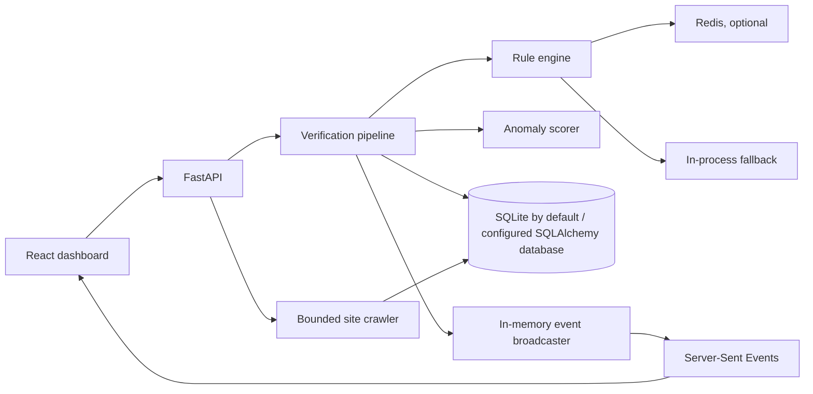

# Architecture

Veles Shield is a demonstration application, not a production-certified fraud or compliance service. This document describes the current implementation.

## Components

## Code organization

- `frontend/src/App.jsx` composes the dashboard shell; `config/` owns navigation and `hooks/` owns dashboard data refresh and event-stream state.
- `components/` contains shared widgets, with dashboard-only pieces grouped under `components/dashboard/`. Screen-level content lives in `views/`.
- `services/api.js` is the frontend API facade. Focused clients under `services/api/` group requests by domain, while `styles/` separates base, layout, dashboard, crawler, responsive, and theme rules in cascade order.
- `backend/aegis/api/v1/` contains endpoint modules and `router.py` composes them. `core/` holds cross-cutting security and audit code, `engine/` holds scoring logic, `services/` handles persistence and external I/O, and `models/` defines database and request/response shapes.

## Verification path

The KYC and transaction endpoints validate Pydantic request models, run rule and anomaly scoring, persist a verification record and audit entry, then broadcast an event in the current process. KYC records encrypt selected PII columns and return masked identifiers. The audit log is hash-linked by application code; the database itself does not provide immutable/WORM storage.

The deterministic engine checks configured format rules, a small disposable email list, a small flagged device list, velocity, and two documentation-only IP subnets. This is not a live threat-intelligence feed. No IP geolocation is performed. PAN checking validates structure/entity character, not issuance or ownership. Aadhaar checking validates format/checksum, not identity. Entropy and EWMA values are heuristic signals, not a trained or validated fraud model.

The anomaly scorer has Python implementations and can use native functions when the shared library loads. Native acceleration is optional; the API exposes whether it loaded. In the current pipeline, synchronous anomaly scoring runs before the asynchronous rule coroutine is awaited, so the implementation should not be described as two parallel scoring engines.

## Company website crawler

`POST /api/v1/crawler/crawl` fetches public pages sequentially. It validates the start URL and every redirect, allows only HTTP/HTTPS on standard ports, rejects non-public resolved addresses, honors `robots.txt`, stays on one origin, limits depth, caps the requested page count at 50 and individual responses at 1 MB, and does not follow external links. The parser extracts title, meta description, H1-H3 headings, same-origin links, and a short body text excerpt. It does not execute JavaScript or download complete page source. Results are stored in `site_crawls` and `crawled_pages`.

This is a bounded, synchronous crawler for small authorized evaluations. It is not a full sitemap crawler, browser renderer, or coverage guarantee. DNS validation in application code cannot fully prevent DNS rebinding; public deployments also need outbound network controls. See [System design principles](SYSTEM_DESIGN_PRINCIPLES.md).

## Persistence and event delivery

SQLAlchemy uses SQLite by default. PostgreSQL can be configured with `DATABASE_URL`, but scaling behavior and migrations require deployment validation. `init_db()` creates missing tables; it is not a schema migration system. Redis is optional for velocity checks. If Redis is unavailable, the in-memory fallback is process-local and counters are not shared across workers.

The SSE broadcaster and recent-event history are in memory and process-local. Recent history is capped at 100 events, but each subscriber queue is currently unbounded. Events are not a durable queue; clients can miss events across restarts or when connected to a different worker. The dashboard polls metrics periodically and loads recent events from the current process. The metrics `active_velocity_keys` field counts the local fallback map, not Redis keys.

## Local demo and production authentication

Local development defaults to `AUTH_ENABLED=false`, which lets the dashboard use an ephemeral local demo identity. Production startup rejects this configuration. Production must explicitly set `AUTH_ENABLED=true` and configure strong secrets. CORS, allowed hosts, database topology, proxy configuration, key rotation, and egress restrictions still require environment-specific review.

## Security and privacy boundaries

Fernet encryption protects selected stored fields; it does not mean the application is legally compliant with a privacy law. HMAC blind indexes support equality lookup patterns, not general encrypted search. The audit chain can detect certain content changes when verified, but an administrator able to rewrite the database and chain can recompute it. Use an external append-only store and controlled key custody for stronger tamper resistance.

No identity provider, sanctions list, live proxy reputation service, external KYC vendor, model training pipeline, or calibrated fraud labels are integrated by default.
